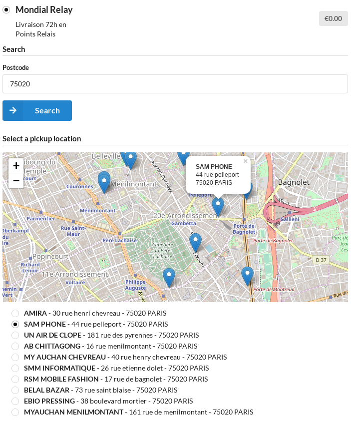

## Features

This Plugin allows to add the Mondial Relay delivery method to Sylius.

* Mondial Relay Pick-up delivery up to 150kg (24R, 24L, DRI)

* Direct shipping management through Mondial Relay web services (shipments registration, shipping labels downloading)

## Overview

With over 40 million parcels delivered through its network of 6500 pick-up points in France (and more than 36000 in Europe) and home delivery services, Mondial Relay is a major actor of delivery to companies and individuals. Thousands of merchants use their services as well as the total control of the logistics process that Mondial Relay offers.

## Screenshot



## Installation

```bash
$ composer require magentix/mondial-relay-plugin
```

Add plugin dependencies to your `AppKernel.php` file:

```php
# app/AppKernel.php

public function registerBundles()
{
    $bundles = [
        ...
        new \MagentixPickupPlugin\MagentixPickupPlugin(),
        new \BitBag\SyliusShippingExportPlugin\BitBagSyliusShippingExportPlugin(),
        new \Magentix\SyliusMondialRelayPlugin\MagentixSyliusMondialRelayPlugin(),
    ];
}
```

Import required config in your `app/config/config.yml` file:

```yaml
# app/config/config.yml

imports:
    ...
    - { resource: "@MagentixPickupPlugin/Resources/config/config.yml" }
    - { resource: "@BitBagSyliusShippingExportPlugin/Resources/config/config.yml" }
    - { resource: "@MagentixSyliusMondialRelayPlugin/Resources/config/config.yml" }
```
    
Import routing in your `app/config/routing.yml` file:

```yaml
# app/config/routing.yml
...

magentix_pickup_plugin:
    resource: "@MagentixPickupPlugin/Resources/config/routing.yml"
    
bitbag_shipping_export_plugin:
    resource: "@BitBagSyliusShippingExportPlugin/Resources/config/routing.yml"
    prefix: /admin
```

Deploy Assets:

```bash
php bin/console sylius:theme:assets:install
```

## Configuration

In *Shipping Method* section from admin, add and configure new Method with *Mondial Relay* Calculator.

In *Shipping Gateway* section from admin, add and configure new Gateway with *Mondial Relay* Shipping Method.

**API test**

* **API WSDL**: https://www.mondialrelay.fr/WebService/Web_Services.asmx?WSDL
* **API Company**: BDTEST13 (test mode)
* **API Reference**: 11 (test mode)
* **API Key**: PrivateK (test mode)